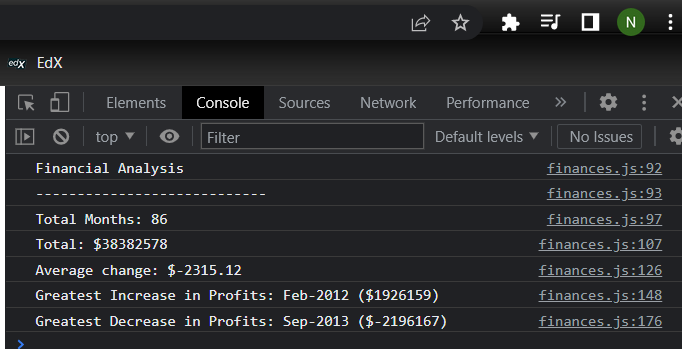

# Console-Finances
Week 4, first JavaScript challenge. 

Aiming to build some JS code that can perform a defined set of calculations based on a given array of financial information. 

The output should be a blank HTML, with the calculation findings logged in the console, again, the format for this presentation is defined.

## Grading Requirements

This homework is graded based on the following criteria: 

### Technical Acceptance Criteria: 40%

✔️ Satisfies all of the defined calculation criteria.

### Deployment: 32%

✔️ Application deployed at live URL.

✔️ Application loads with no errors.

✔️ Application GitHub URL submitted.

✔️ GitHub repository contains application code.

### Repository Quality: 12%

✔️ Repository has a unique name.

✔️ Repository follows best practices for file structure and naming conventions.

✔️ Repository follows best practices for variable naming conventions, indentation, quality comments, etc.

✔️ Repository contains multiple descriptive commit messages.

✔️ Repository contains quality readme with description, screenshot, link to deployed application.

## Review

You are required to submit BOTH of the following for review:

✔️ The URL of the deployed application.

✔️ The URL of the GitHub repository that contains your code. Give the repository a unique name and include a README file that describes the project.

## Built With

* [JavaScript](https://www.javascript.com/)

## Authors

* **Natalie Navickas** - *Initial work* - [NatalieNavickas](https://github.com/NNavickas)

---
* **Nathan Crockwell** - *Contributor during class time, no commits* - [PurpleBooth](https://github.com/PurpleBooth)

* **Bethany Ryalls** - *Contributor during class time, no commits* - [PurpleBooth](https://github.com/PurpleBooth)

## Acknowledgments

* Hat tip to anyone whose code was used
* Inspiration
* etc
